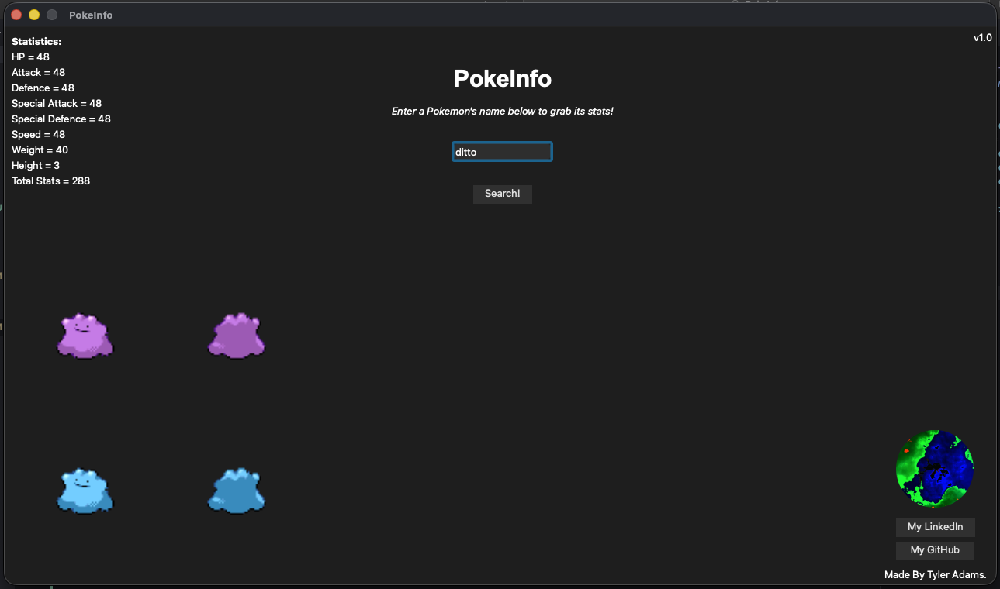

# PokeInfo
### Welcome to this project! Here is the rundown on PokeInfo!

PokeInfo is an application made in Python with the PyQt6 GUI Library.

It utilises the Pokemon API to take user input and display stats and images of the searched pokemon.

Here is an image of the UI:

This is a side project that introduced me to APIs and filtering through JSON files to extract information.

Current Version: 1.0.0 (Following Semantic Versioning)
